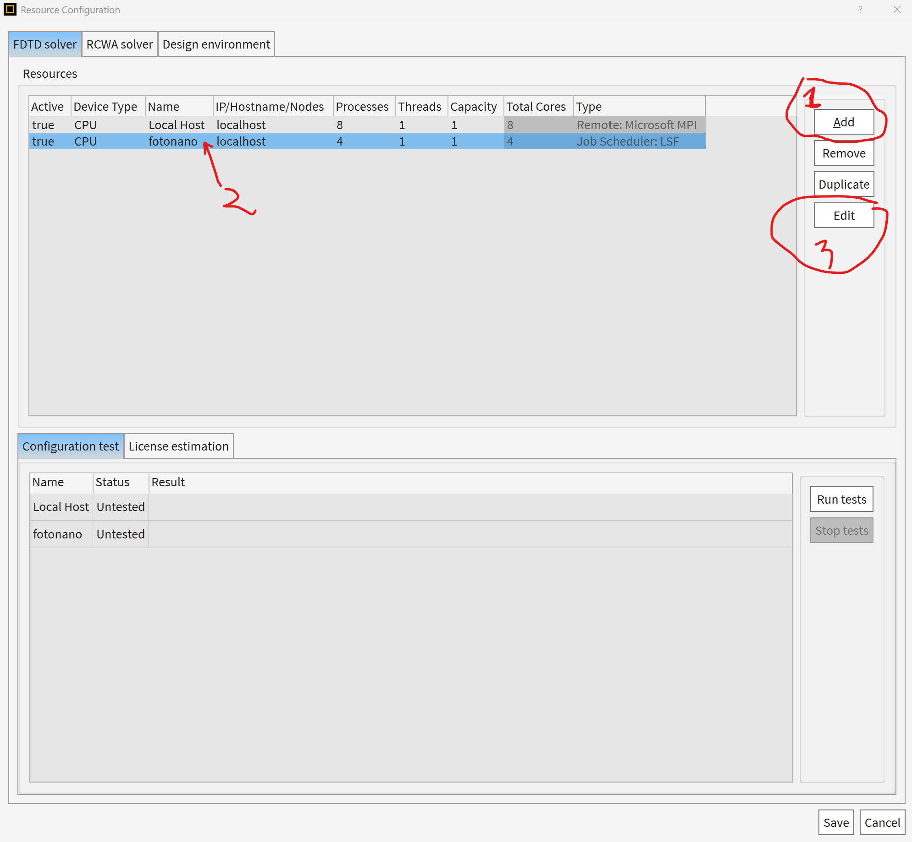
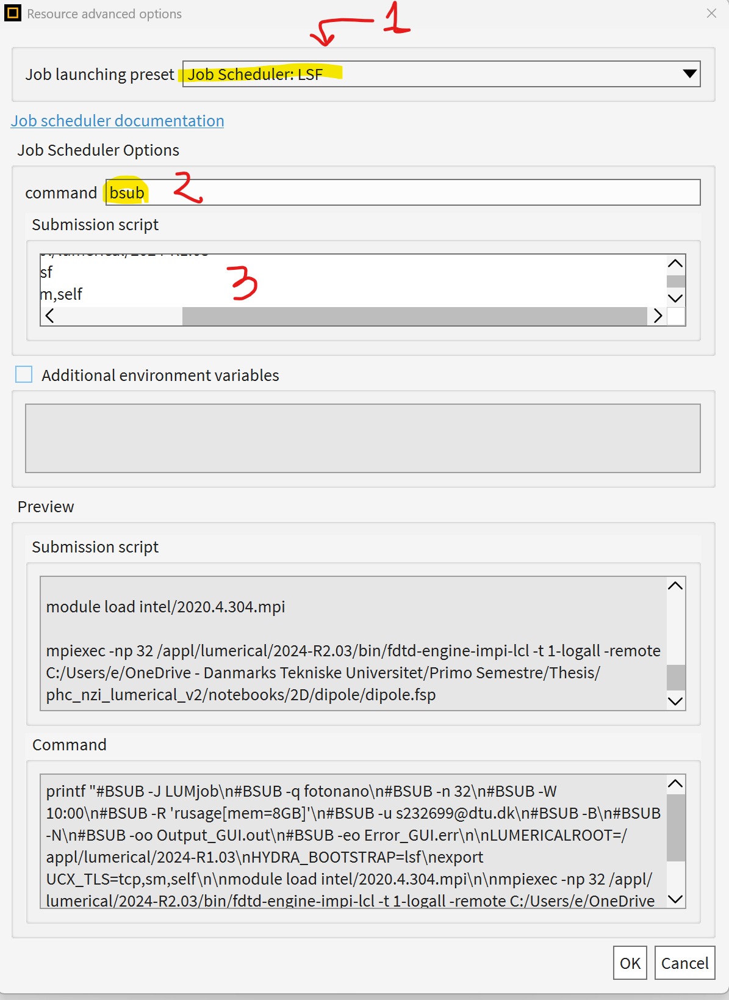
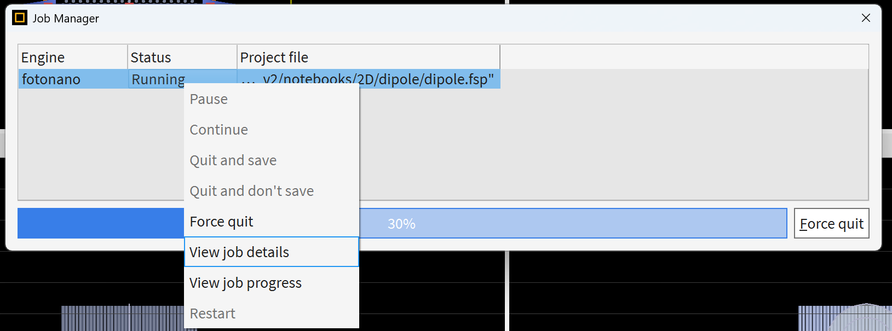

# Ansys Lumerical: LSF jobs using DTU HPC
enrico.vallar2000@gmail.com (s232699@dtu.dk)

## Introduction 
Ansys Lumerical is a suite of photonic simulation tools used for designing and analyzing photonic devices. 
This guide explains how to efficiently run Lumerical simulations as LSF jobs on the DTU High Performance Computing (HPC) cluster.


## The Old Slow Method
As far as I know people usually connect to HPC via SSH using programs like MobaXterm or ThinLink. 
The simulation file is prepared on a Personal Computer, manually copied to an HPC folder and finally it is run using an LSF jobs. 
The LSF job script has to be prepared following the instructions reported on [DTU HPC Guide "Batch Jobs under LSF 10"](https://www.hpc.dtu.dk/?page_id=1416) 
and it is then submitted using
```
bsub < job.sh
```
The user then waits until the simulation is finished and then manually copies the completed simulation in a different folder if needed. 

This method has some problems:
- It is not automatic: many manual boring steps are required to copy the file, edit the job script and submit the job.
- It is not possible to use at best the features of Lumerical GUI like Sweep or Optimization

## Submitting LSF jobs from Lumerical GUI on a PC
It is possible to submit LSF jobs from the Lumerical GUI of versions >2024. This is explained in the guide ["Lumerical job scheduler integration (Slurm, Torque, LSF, SGE)"](https://optics.ansys.com/hc/en-us/articles/360034620113-Lumerical-job-scheduler-integration-Slurm-Torque-LSF-SGE). However, some additional considerations are necessary to make this work on DTU HPC.

The steps that I am going to present are the following:
1. [Passwordless SSH](#passwordless-ssh)  
2. [The job_scheduler_input.json file](#configure-lumericals-job-scheduler-json)  
3. [The Lumerical LSF Resource](#configure-the-lumerical-resource)  
4. [The lsf.py file](#the-lsfpy-file)
5. [Final Notes](#final-notes)


### Passwordless SSH
DTU HPC use two factor authentication. We assume the user is connected to DTU Secure Network or DTU VPN. 
We also assume that the user has OpenSSH installed on its PC. If not, consider downloading Git for Windows.

#### Generate your ED25519 key without a passphrase
Open GitBash. 
First create your local SSH folder if you don't have it already
```
mkdir -p ~/.ssh
chmod 700 ~/.ssh
```
Now generate the key
```
# Generate ED25519 key with empty passphrase
ssh-keygen -t ed25519 -f ~/.ssh/lumerical_ed25519 -N ""
```
Verify the keys have been generated using 
```
ls -l ~/.ssh/lumerical_ed25519*
```
You will now have:
- C:\Users\YourUser\.ssh\lumerical_ed25519
- C:\Users\YourUser\.ssh\lumerical_ed25519.pub

#### Upload your public key to DTU HPC
First create the remote `.ssh` directory if missing. This will be on your gbar Home folder. Use your dtu username in place of `username`:
```
ssh username@transfer.gbar.dtu.dk "mkdir -m 700 -p ~/.ssh"
```
Now it is time to upload your public key, using
```
scp ~/.ssh/lumerical_ed25519.pub username@transfer.gbar.dtu.dk:~/.ssh/authorized_keys
```
Finally secure the key file>
```
ssh username@transfer.gbar.dtu.dk "chmod 600 ~/.ssh/authorized_keys"
```
So that only you can read your public key file.

#### Test passwordless key authentication 
```
ssh -i ~/.ssh/lumerical_ed25519 username@login2.hpc.dtu.dk
```
- You should not be prompted for any SSH key passphrase
- You still need to be connected to DTU Secure or DTU VPN (two-factor requirement)


### Configure Lumerical's Job Scheduler JSON
Copy the following template into your user config folder (if a Lumerical Folder is not there, make it):

- Linux: `~/.config/Lumerical/job_scheduler_input.json`

- Windows: `%APPDATA%\Lumerical\job_scheduler_input.json`

```
{
    "user_name": "YOUR_DTU_USERNAME",
    "use_ssh": 1,
    "use_scp": 1,
    "cluster_cwd": "/path/to/lumerical_jobs/",
    "master_node_ip": "login2.hpc.dtu.dk",
    "ssh_key": "~/.ssh/lumerical_ed25519",
    "path_translation": ["C:/local/path/lumerical?jobs", "/path/to/lumerical_jobs/"]
}

```
Edit the template to include your DTU Username, and the two lumerical jobs folders, one in your PC and one in DTU HPC. 

I suggest to use the Scratch space on DTU HPC - request it to DTU HPC Service if needed.


### Configure the Lumerical Resource
Open Lumerical 2024 or 2025 version installed on your PC. 
I will show this process for Lumerical FDTD 2025. 

1. Open the resources options


2. Add a new resource, give it a name and press edit


3. Select the `Job Sheduler: LSF` job launching preset (1); in the options choose `bsub` as command (2). Finally, insert the submission script (3, explained later). Additional environment variables are not needed. 


4. The submission script: 
```
#!/bin/sh
#BSUB -J LUMjob
#BSUB -q fotonano
#BSUB -n 32
#BSUB -W 10:00
#BSUB -R 'rusage[mem=8GB]'
#BSUB -u username@dtu.dk
#BSUB -B
#BSUB -N
#BSUB -oo Output_GUI.out
#BSUB -eo Error_GUI.err

LUMERICALROOT=/appl/lumerical/2024-R1.03
HYDRA_BOOTSTRAP=lsf
export UCX_TLS=tcp,sm,self

module load intel/2020.4.304.mpi

mpiexec -np 32 /appl/lumerical/2024-R2.03/bin/fdtd-engine-impi-lcl -t 1-logall -remote {PROJECT_FILE_PATH}
```
This submission script is based on the example reported in `/appl/lumerical/jobscript2024.sh/` with some variations. Note that we use `'` instead of `"` otherwise it will not work.

> **Note:**  
> <span style="color:red">Note that this example works for FDTD simulations. If you want to make it work for EME of FDE simulations you need to use another engine. For example, for EME simulations you need to use `eme-engine-impi-lcl` instead of `fdtd-engine-impi-lcl`. A list of all the engines can be found using the command `ls /appl/lumerical/2024-R2.03/bin` on DTU HPC.</span>


5. Press ok and save.


### The lsf.py File.

Now it is time to edit one of the Lumerical script in our installation. This is the script used for submitting the commands, transfering the files and checking the status of the simulation.  It can be foun in `"YOUR\PATH\TO\Lumerical\v251\scripts\job_schedulers\lsf.py"`

The original script has two problems:
1. bsub 

    bsub as it is doesn't work. 
    The original script relies on a command that invokes a non-login, non-interactive shell on the remote side. The LSF envirenment variables anr not sourced in this case and bsub does not work. 
    For this reason we must wrap bsub in a login shel so that `bsub` becomes `bash -l -c bsub`. 

2. Status check 

    The original script check the status of the simulation invoking `bjobs` but then read the wrong word in the returned line - so that it thinks that the simulation is never running after it goes in the jobs queue (to check if the job is in the queue, the script only checks if a line is returned).

    Also, when the simulation is DONE, the command `bjobs [job id]` does not return a proper status line because in a non interactive shell the history of the jobs is not preserved. 


<span style="color:red">You can find the patched file in this repository.</span>


### Final Notes
1. If you have not use Lumerical on HPC yet, make sure the license it's properly configured. You can try this opening Lumerical from ThinLink or MobaXterm: 

    ```
    /appl/lumerical/2024-R2.03/bin/fdtd-solutions
    ```

    If an error occurs, the GUI will prompt you to a panel where you can configure the license. 


2. You should now be able to run the simulation choosing the proper resource:


3. If you right click on status>View job Details, you can see the log from the lsf.py file. You can edit the lsf.py file log commands to debug. 



4. The simulation progrss bar does not progress after the simulation enter in the status "Running". Also, when the simulation finishes, some time is required to copy the file on the client. Consider to check the job details to check when the simulation is done - but if you entered your email on the submission script you should also receive an email when the simulation is Done. 

5. Consider to edit the simulation script if you want to use a different queue (i.e. hpc instead of fotonano if you still do not have access to it, the number of cores, or the engine in the case of the MODE FDE GUI).

6. If you have any questions or some suggestions - plese contact me (enrico.vallar2000@gmail.com , s232699@dtu.dk)


